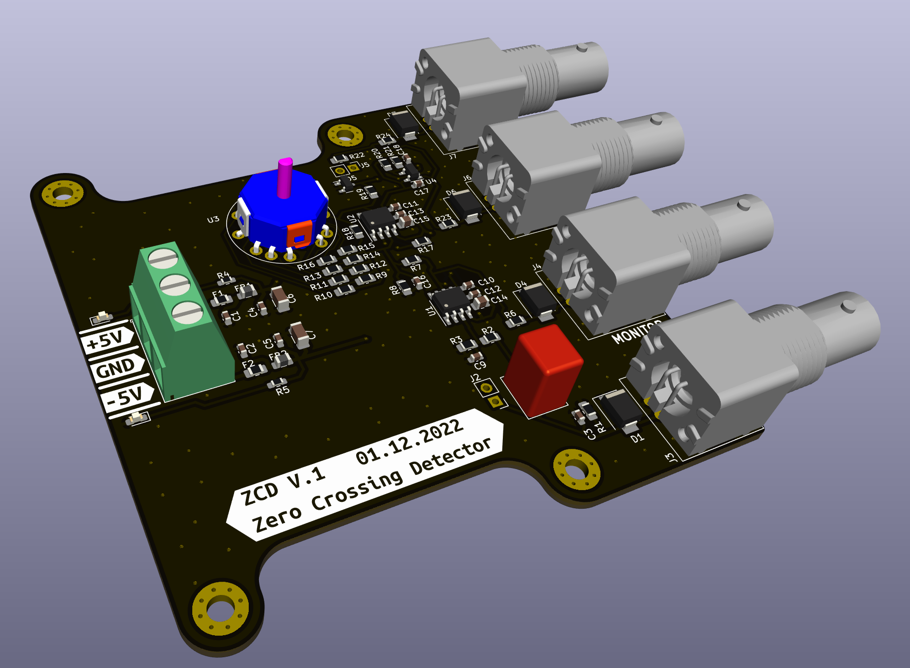

# Zero Crossing Detector (ZCD) 
*Designed for use with Fourier Transform Spectrometers.* 
This device converts symmetric sinusoidal signal from the reference beam detector into a TTL-compatible trigger for acquisition. 

Main features: 
- two TTL outputs 
- one intermediate monitor output
- one input 
- requires an external +-5 V symmetric supply
- accepts signals up to 20 V AC peak-peak +- 10 V DC
- input frequency up to 5 MHz
- hysteresis selectable with a rotary switch from about 20mV up to 2V 

